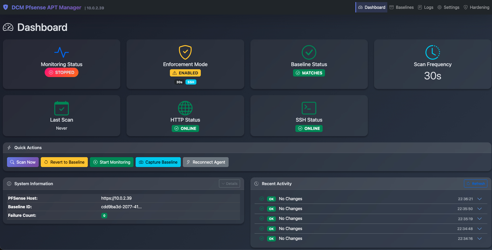

# DCM PFSense APT Manager




A security application that monitors PFSense firewall configurations for unauthorized changes and automatically reverts them to a known good baseline. Designed to protect against Advanced Persistent Threats (APTs) that may attempt to modify firewall rules. 
## Features

- **Configuration Monitoring** - Continuously monitors PFSense configurations for unauthorized changes
- **Automatic Enforcement** - Automatically reverts unauthorized changes via SSH (recommended) or Web API
- **Web Dashboard** - Modern web interface for management and monitoring
- **Hardening Tools** - Built-in security hardening capabilities:
  - Active session monitoring (Web GUI & SSH)
  - System user auditing against known-good baseline
  - PHP file integrity checking
  - Firewall rule locking
- **Syslog Integration** - Send logs to external SIEM with configurable log levels
- **Comprehensive Logging** - Detailed audit trail of all configuration changes
- **Alerts with sounds to make team aware of changes 

## Quick Start

```bash
# Clone the repository
git clone https://github.com/funkyak/pfsesne-manager
cd dcm-pfsense-apt-manager

# Start with Docker
docker-compose up -d

# Access web interface
open http://localhost:8080
```

**Default credentials:** `admin` / `admin`

## Initial Setup

1. Navigate to **Settings** in the web interface
2. Enter your PFSense firewall details:
   - Host (IP address)
   - Username & Password
   - SSH credentials (recommended for enforcement)
3. Go to **Baseline** and capture your first baseline configuration
4. Enable **Enforcement Mode** to automatically revert unauthorized changes

## Configuration


### Enforcement Methods

- **SSH (Recommended)** - Direct config restoration via SSH. Requires SSH access to PFSense. SSH Password or SSH Key supported
- **Web API** - Uses PFSense web interface. Fallback if SSH unavailable.

SSH credentials will automatically fall back to PFSense web credentials if not separately configured.

## Architecture

```
┌─────────────────────────────────────────┐
│         Web Interface (Flask)           │
│  Dashboard | Baseline | Logs | Settings │
└─────────────────────────────────────────┘
                    │
┌─────────────────────────────────────────┐
│         Monitoring Engine               │
│  Change Detection | Auto-Enforcement    │
└─────────────────────────────────────────┘
                    │
┌─────────────────────────────────────────┐
│      PFSense Integration Layer          │
│     SSH Client | Web Scraper            │
└─────────────────────────────────────────┘
```

## Docker Services

| Service | Description | Port |
|---------|-------------|------|
| `dcm-web` | Web interface | 8080 |
| `dcm-monitor` | Background monitoring daemon | - |

## Security Notes

- Change default credentials immediately in production
- SSH method is recommended for enforcement (more reliable)
- All credentials are encrypted at rest
- Configuration files secured with restricted permissions

## License

Copyright © 2024 - 6 Cyber ®
